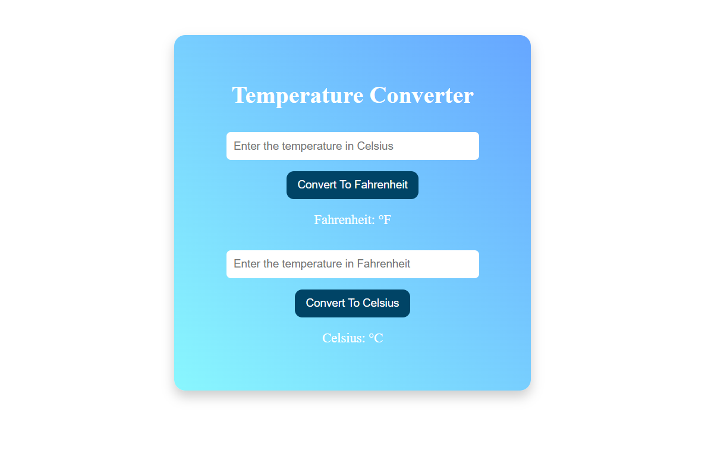

# 🌡️ Temperature Converter App

A simple and interactive Angular application to convert temperature values between **Celsius** and **Fahrenheit** in real time.

---

## 📸 Screenshots

### 💠 Explorer Files View


### 💠 Desktop View


---

## ✨ Features

✅ Beautiful UI with a modern gradient card layout  
✅ Convert Celsius to Fahrenheit  
✅ Convert Fahrenheit to Celsius  
✅ Keyboard shortcut: press `Enter` to convert  
✅ Responsive and centered layout  
✅ Input sanitization: No default 0, no spinner arrows  
✅ Clean code with Angular best practices

---

## 🛠️ Tech Stack

- Angular (v16+)
- TypeScript
- HTML5
- CSS3 (with Linear Gradient and Flexbox)
- FormsModule (for two-way data binding)

---

## 🚀 Getting Started

### 1. Clone the repository

```bash
git clone https://github.com/yourusername/temperature-converter.git
cd temperature-converter
```

### 2. Install dependencies

```bash
npm install
```

### 3. Run the app locally

```bash
ng serve
```

Visit `http://localhost:4200` to view it in your browser.

---

## 🧠 How It Works

- Users can enter a temperature value in either Celsius or Fahrenheit.
- On clicking the button or pressing Enter, the app converts and displays the result.
- The app uses `[(ngModel)]` for two-way binding and `FormsModule` for data input.

---

## 🌐 Connect

- GitHub: [@Pavan-441](https://github.com/Pavan-441)
- LinkedIn: [Pavan-Kumar-Pedamallu](https://linkedin.com/in/Pavan-Kumar-Pedamallu)

